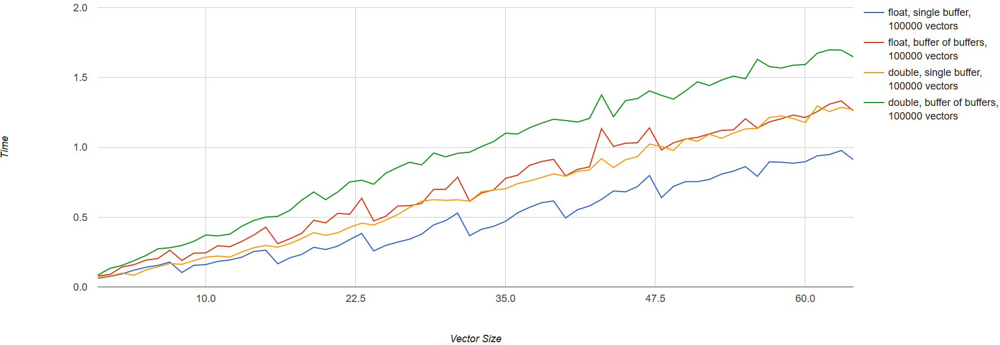

# Floating point performance benchmark

# About
A small afternoon project aiming to test a particular algorithm: given M-length list of N-dimensional vectors, normalize each vector (so that `"sum 1...N"==1.0` for each vector). Typical use cases in real life application (www.ngskintools.com) is M being in range of 10,000-200,000, and vector length varying from as low as 2 to as high as few hundred.

Decisions to be made:
* is `float` or `double` for vector component a better choice from performance point of view;
* 2-dimensional matrix memory layout: single-buffer vs buffer-per-vector - any performance drawbacks, not counting the allocation time;

C++ application runs multiple tests (with M being `1,000, 10,000, 100,000`) and vector length range `[1..64]`, for both `float` and `double` as vector component types, and for different memory allocation types. Output is simple CSV report.

Python script then helps to crunch the numbers into interactive HTML line chart for later analysis. Sample of captured data and produced html is available in `visualise` folder.

Only single-threaded performance was being tested.

## Short recap of analysis:

* Even though the algorithm per vector is not too trivial, floating point operations don't seem to be the bottleneck - instead, memory bandwidth is;
* For very low vector sizes, both `double` and `float` performance was comparable;
* For vector size above `16`, floats start to perform better, with certain thresholds giving significant boost: normalization of vector length 14 is 30% slower than normalizing vector of length 16 (other thresholds - 8, 24, 32, 40, 48), giving the hint that vector length should be multiples of 8.
* No huge decrease in performance for multi-buffer memory layout; this can help in the future knowing that one contiguous block for all vectors is not required for performance; 
* Conclusion - seems like floats are the way to go, given that most values in vectors do not exceed 1.0, and precision of single value should be good enough;

## Sample output

Above graph shows:
* Number of vectors ("mesh size"): 100,000;
* X axis: vector size
* Y axis: time in seconds
* measurement: normalize 100,000 vectors 100 times (the lower the better);

It can clearly seen how multiples of 8 give much better performance for floats. Overall floats start to win once buffer sizes grow up.

## TODO

* not sure if SSE was utilized for `float`s;
* not sure if best compilation options were chosen for Windows build - Linux/g++ ran faster on virtual machine on the same hardware;